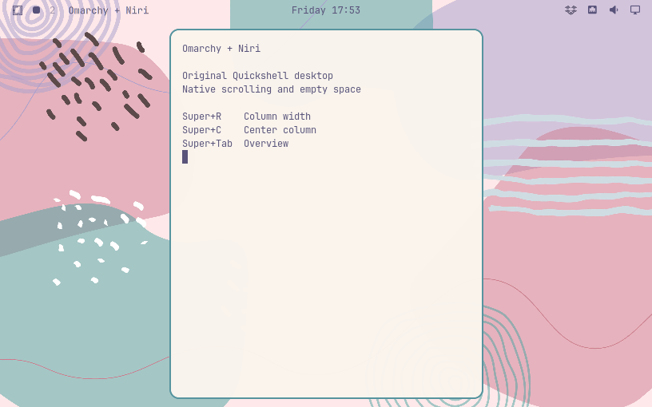

# Omarchy Niri

将已有 Omarchy 的 Hyprland 会话替换为 Niri，保留原版 Quickshell 外壳、
常用快捷键，以及 Niri 的滚动布局和留白。直接安装，无需重装或制作镜像。

A Niri replacement for an existing Omarchy desktop. The bar, menus, notifications,
clipboard, themes and desktop services stay with Omarchy. This is an independent
extension, not an upstream Omarchy plugin or a separate distribution.



## How it works

Omarchy resolves everything through `$OMARCHY_PATH`, and ships `omarchy dev link`
to point that at another tree. This extension points it at an **overlayfs view**:

```
/run/omarchy/niri  =  overlay/  ∪  patched/  ∪  /usr/share/omarchy
                      Niri files   upstream files   the package, untouched
                                   with small diffs
```

Nothing is copied or versioned. Package upgrades show through the view
immediately; only the handful of patched files are regenerated by a pacman hook.
`omarchy dev status` reports the link like any dev checkout.

## Install

Requires **Omarchy 4.0.2** and **Niri 26.04+**. This is an Omarchy plugin:

```sh
omarchy plugin add https://github.com/cunninghamcard-bit/omarchy-niri.git --enable
```

Enabling it shows a notification; click it to run the one-time system setup in a
terminal (it asks for your sudo password), then log out and select
**Omarchy (Niri)**, or reboot. The remembered Omarchy session also starts Niri.

Without the plugin route, clone the repository and run
`sudo ./omarchy-niri-extension install` from your desktop account.

## Shortcuts and configuration

Omarchy key positions remain the baseline. Only eight directional combinations
are adapted from [2725244134/dotfiles](https://github.com/2725244134/dotfiles/tree/4a96e1e36f4e19fd8d24d04ace95fa832a01c16e/niri/.config/niri):

| Keys | Action |
| --- | --- |
| Super + Left / Right | Focus the next column; at the end, continue to the adjacent monitor |
| Super + Up / Down | Focus the workspace above / below |
| Super + Ctrl + Left / Right | Move the current column left / right |
| Super + Ctrl + Up / Down | Move the column to the workspace above / below |

A column can contain several windows. Columns start at half width and keep
empty space; only explicit sizing or maximization changes their width.

`Super+W` closes, `Super+T` toggles floating, `Super+F` toggles fullscreen,
`Super+Alt+F` maximizes a column, and `Super+Shift+F` opens the file manager.
`Super+K` shows shortcuts. Personal settings live in `~/.config/niri/input.kdl`,
`outputs.kdl`, and `bindings.kdl`; they are never rewritten. Themes generate
Niri borders; radius and gaps live in `~/.config/omarchy/niri-style.json`.

Hyprland-specific layouts are not identical: tabbed columns handle grouping,
and pop-window toggles floating without pinning. Universal Super+C/V/X
forwarding, scratchpads and pseudo-tiling are not implemented. See
[acceptance and limits](docs/acceptance.md).

## Update, status, uninstall

```sh
omarchy plugin update omarchy-niri        # pull the plugin; a notification offers the system update
omarchy-niri-extension status             # mount state, versions, patch failures
sudo omarchy-niri-extension uninstall     # restore the Hyprland session
omarchy plugin remove omarchy-niri
```

`omarchy update` works as before; the package upgrade re-applies the patches
automatically. If one of them no longer fits the new package, `status` names
the file; everything else keeps working. Uninstall restores every system file
the installer wrote and keeps aside any edits made to them afterwards.

## Code and verification

- `overlay/`: Niri code and complete replacements, laid out like `/usr/share/omarchy`.
- `patches/`: unified diffs for small changes to larger Omarchy files.
- `omarchy-niri-extension`: install, update, rebuild, uninstall, status, notify.
- `manifest.json` + `plugin/Service.qml`: the Omarchy plugin wrapper that prompts for setup and updates.

```sh
python3 -m unittest discover -s tests -v
node tests/niri-model-test.cjs
bash tests/test_extension.sh
```

CI also checks that every patch still applies to the pinned Omarchy source.
See the [design](docs/architecture.md).

## Credits

Omarchy and its Quickshell UI: David Heinemeier Hansson and contributors (MIT).
Niri: niri-wm contributors. Directional keybindings: 2725244134/dotfiles.
