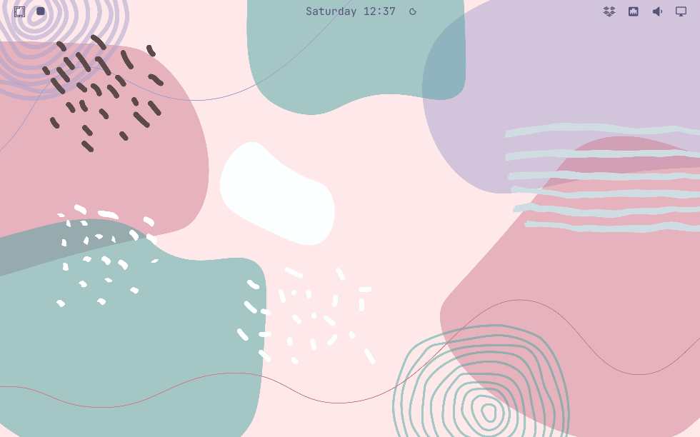

# Omarchy Niri

将已有 Omarchy 的 Hyprland 会话替换为 Niri，保留原版 Quickshell 外壳、
常用快捷键，以及 Niri 的滚动布局和留白。直接安装，无需重装或制作镜像。

A Niri replacement for an existing Omarchy desktop. The bar, menus, notifications,
clipboard, themes and desktop services stay with Omarchy. This is an independently maintained Omarchy service plugin. Its installer
provides the Niri session; Omarchy continues to supply the desktop shell.



## How it works

Omarchy locates its scripts, shell and defaults through `$OMARCHY_PATH`, and ships `omarchy dev link`
to point that at another tree. This extension keeps the same lookup contract, but
publishes a **complete, private runtime**:

```
/var/lib/omarchy-niri/current -> runtimes/<release-id>
                                  complete Omarchy tree with Niri changes
```

Each update prepares a new runtime from the installed Omarchy package, applies
the reviewed replacements and patches, validates the resulting tree, and then
changes one `current` symlink. The previous runtime is retained when an
Omarchy upgrade no longer matches the compatibility manifest.

## Install

The reviewed compatibility target is **Omarchy 4.0.2** (commit
`346e69e1cec6c4e8924531874af6ba010a1bc99e`) and **Niri 26.04+**. This is an
Omarchy plugin:

```sh
omarchy plugin add https://github.com/cunninghamcard-bit/omarchy-niri.git --enable
```

Enabling it shows a notification; click it to run the one-time system setup in a
terminal (it asks for your sudo password), then log out and select
**Omarchy (Niri)**, or reboot. The remembered Omarchy session also starts Niri.

Without the plugin route, clone the repository and run
`sudo ./omarchy-niri-extension install` from your desktop account.

For an existing 0.1/0.2 installation, run `sudo ./omarchy-niri-extension update`
from the updated checkout. It retains the original uninstall backups. The
experimental overlayfs installer must be uninstalled before using this version.

## Shortcuts and configuration

Omarchy key positions remain the baseline. Only eight directional combinations
are adapted from [2725244134/dotfiles](https://github.com/2725244134/dotfiles/tree/4a96e1e36f4e19fd8d24d04ace95fa832a01c16e/niri/.config/niri):

| Keys | Action |
| --- | --- |
| Super + Left / Right | Focus the next column; at the end, continue to the adjacent monitor |
| Super + Up / Down | Focus the workspace above / below |
| Super + Ctrl + Left / Right | Move the current column left / right |
| Super + Ctrl + Up / Down | Move the column to the workspace above / below |

A column can contain several windows. Columns start at half width and keep
empty space; only explicit sizing or maximization changes their width.

`Super+W` closes, `Super+T` toggles floating, `Super+F` toggles fullscreen,
`Super+Alt+F` maximizes a column, and `Super+Shift+F` opens the file manager.
`Super+K` shows shortcuts. Personal settings live in `~/.config/niri/input.kdl`,
`outputs.kdl`, and `bindings.kdl`; they are never rewritten. Themes generate
Niri borders; radius and gaps live in `~/.config/omarchy/niri-style.json`.

Hyprland-specific layouts are not identical: tabbed columns handle grouping,
and pop-window toggles floating without pinning. Universal Super+C/V/X
forwarding, scratchpads and pseudo-tiling are not implemented. See
[acceptance and limits](docs/acceptance.md).

## Update, status, uninstall

```sh
omarchy plugin update omarchy-niri        # pull the plugin; a notification offers the system update
omarchy-niri-extension status             # active runtime, versions, compatibility failures
sudo omarchy-niri-extension uninstall     # restore the Hyprland session
omarchy plugin remove omarchy-niri
```

`omarchy update` works as before. The package hook prepares a candidate runtime
against the new package and switches to it only after all checks pass. If the
upstream tree changes a replacement, rejects a patch, or exposes a new Hyprland
call, `status` reports the reason in `upgrade-failed.txt` and the previous
runtime stays selected. Old runtimes are kept for recovery.
The update command stops migrations on a compatibility failure; after a
successful rebuild, it runs them from the newly published runtime.

The compatibility manifest is reviewed per Omarchy release. A new upstream call
is not translated automatically: maintainers update the relevant replacement or
patch, refresh its base hash, run the pinned and upstream CI checks, and publish
a new plugin version. Niri, Qt, and other system binaries still come from the
host package manager; snapshots cover Omarchy scripts and shell files only.

## Code and verification

- `overlay/`: Niri code and complete replacements, laid out like `/usr/share/omarchy`.
- `patches/`: unified diffs for small changes to larger Omarchy files.
- `manage.py` + `compat.py`: prepare, validate, publish, update, uninstall, status, notify.
- `manifest.json` + `plugin/Service.qml`: the Omarchy plugin wrapper that prompts for setup and updates.

```sh
python3 -m unittest discover -s tests -v
node tests/niri-model-test.cjs
bash tests/test_extension.sh
```

CI prepares a complete candidate against the pinned Omarchy source and checks
upstream main on a schedule. See the [design](docs/architecture.md) and
[upgrade validation](docs/upgrade-validation.md).

## Credits

Omarchy and its Quickshell UI: David Heinemeier Hansson and contributors (MIT).
Niri: niri-wm contributors. Directional keybindings: 2725244134/dotfiles.
